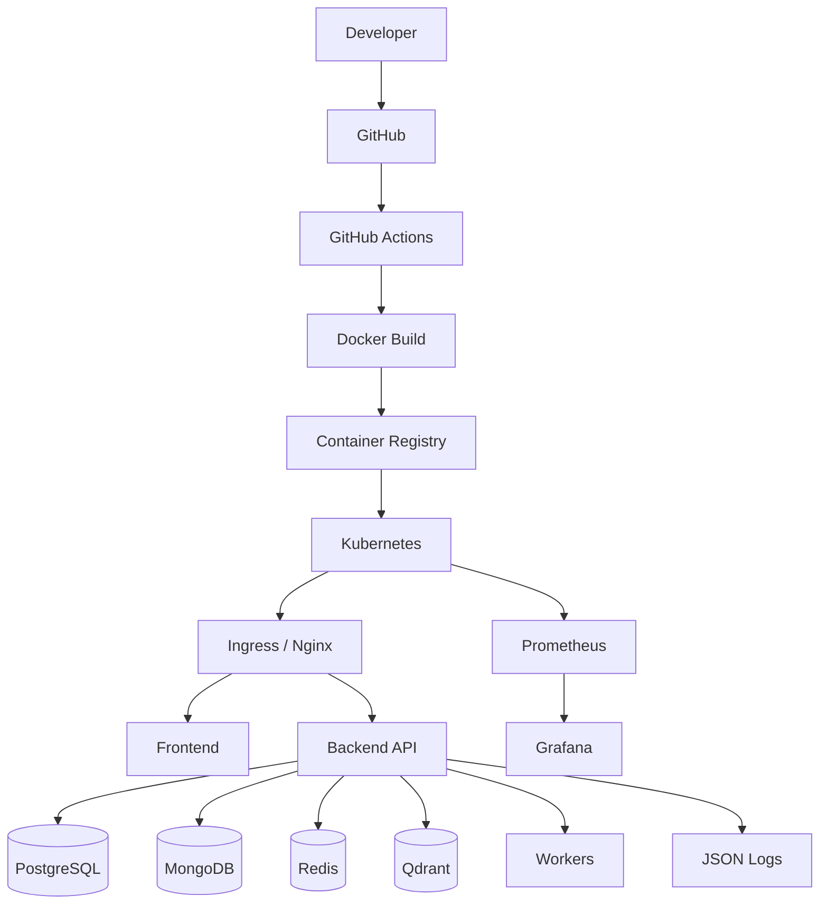
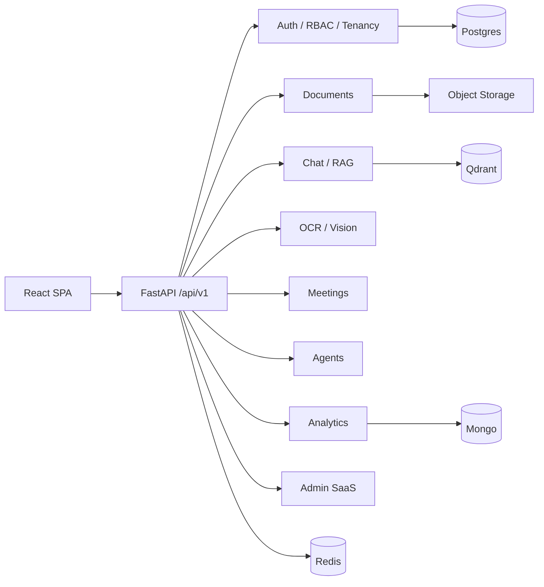
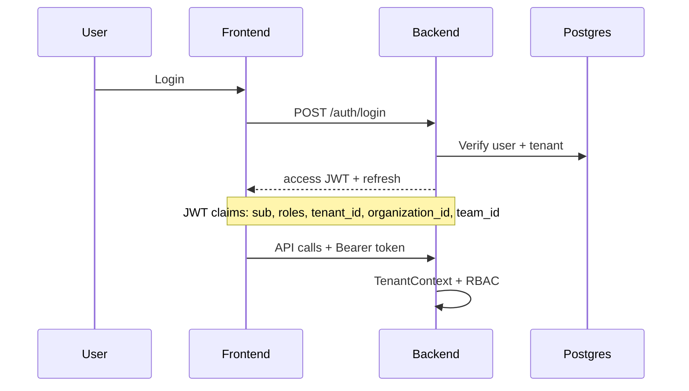
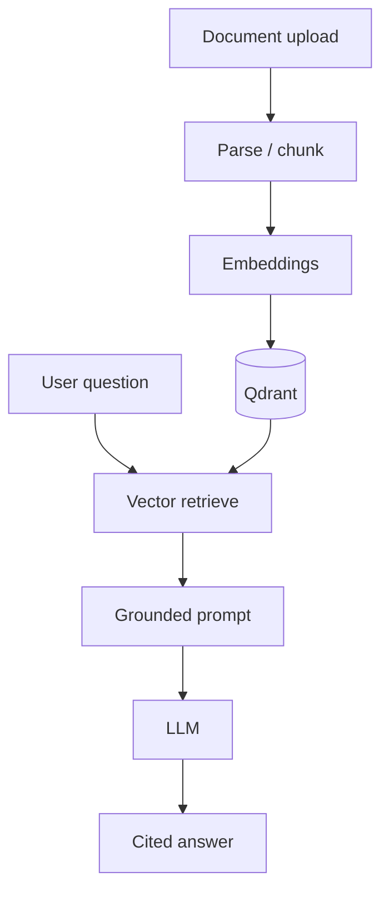
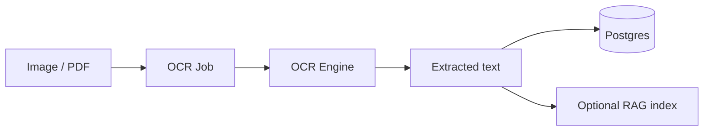
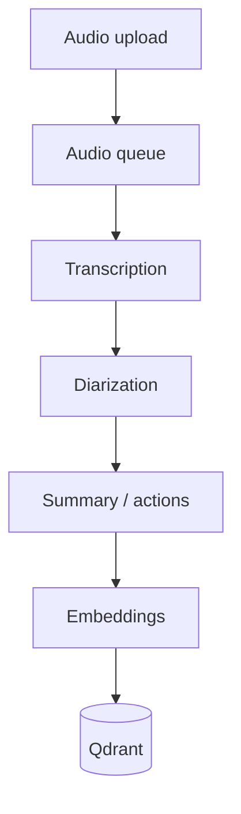
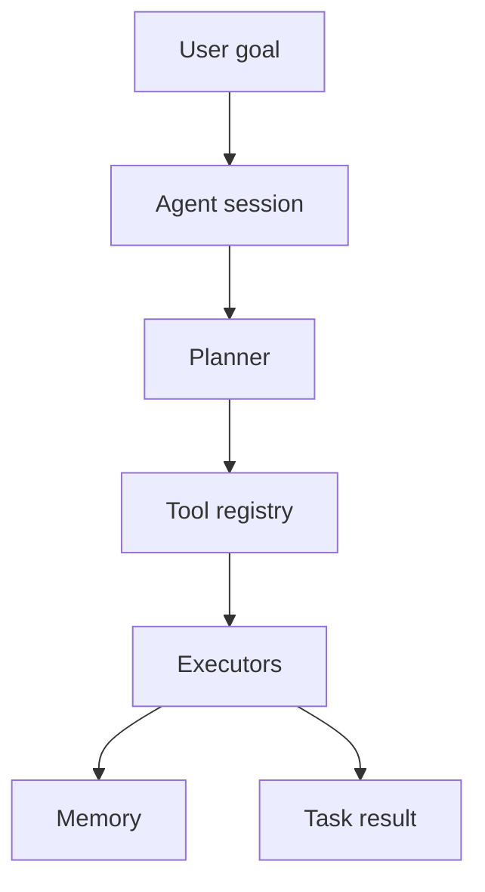
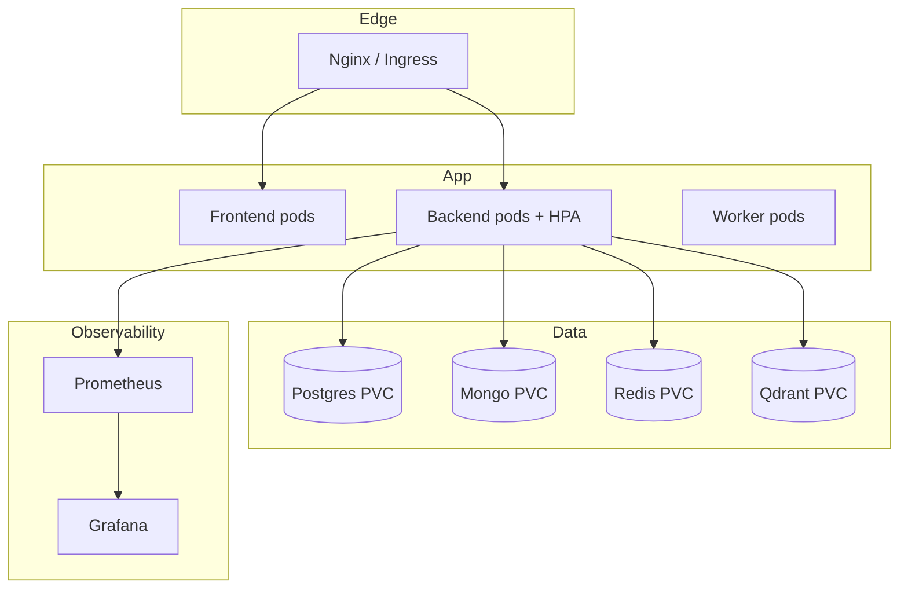

# Architecture

## Production architecture

## Logical application layers

## Authentication flow

## RAG pipeline

## OCR pipeline

## Meeting pipeline

## Agent pipeline

## Deployment architecture

## Multi-tenancy

`Tenant → Organization → Team → User → Permissions → Resources`

Every admin and data path is scoped by `tenant_id`. JWT carries tenant claims; `TenantContextMiddleware` enforces request scope.
